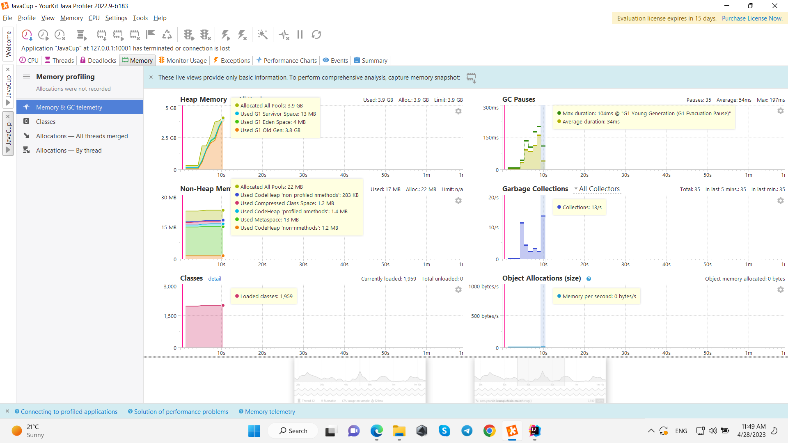

| full name     | student number |
|---------------|----------------|
| Alireza Eiji  | 98101193       |
| Shayan Talaei | 98109548       |

Part 1:

در بخش اول انجام آزمایش با استفاده از ابزارهای پروفایلر به بررسی قسمتی از کد که بیشترین زمان را میبرد پرداخته ایم

تصاویر زیر به داده های مربوط به نمودار مصرف پردازنده  و حافظه و مسیرهایی از کد که بیشترین زمان در آن جا صرف شده بوده است.

تصاویر بالا مصارف رم و پردازنده را نشان میدهد همچنین نشان میدهد که تابع 

temp

بیشترین مصرف منابع را داشته است.
 
باید توجه داشت که با اجرای برنامه به خطا برخورد میکنیم زیرا برنامه به شدت حافظه مصرف میکند و حافظه هیپ کم می آورد.

Part 2:

در این بخش برای آن که یک مثال از بهبود دادن کد بدهیم از این سناریو استفاده نموده ایم. تصور کنید که یک کاربر با داده ای خاص در یک پایگاه داده وحود دارد.

فرض کنید 10000 کاربر پشت سر هم به طور متوالی داده این کاربر را از دیتابیس بخوانند. در این جا برای سادگی کار از یک فایل جیسون که بر روی دیسک در قسمت

resources 

نوشته شده است. برای بهبود نیز یک تابع توسعه داده شده که از کش بر روی رم استفاده میکند و کلاس کش همان 

MemoCache

میباشد.

حال به تصاویر زیر که حاصل اجرای برنامه با کش و بدون کش است دقت کنید.

همان طور که مشاهده میشود اگر فقط از روی دیسک بخوانیم بدون استفاده از کش حدود 10 ثانیه طول میکشد

ولی اگر از کش نیز استفاده شود حدود 1 ثانیه استفاده میشود.